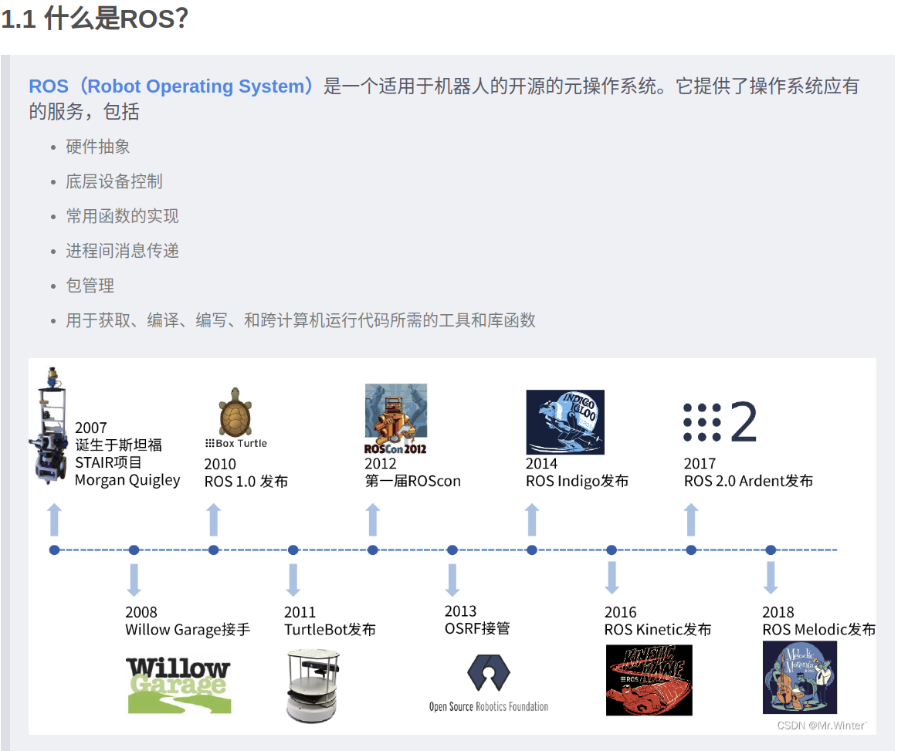
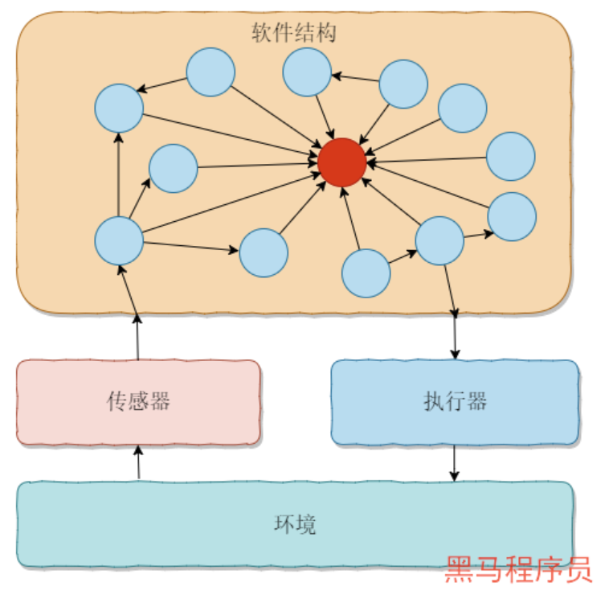
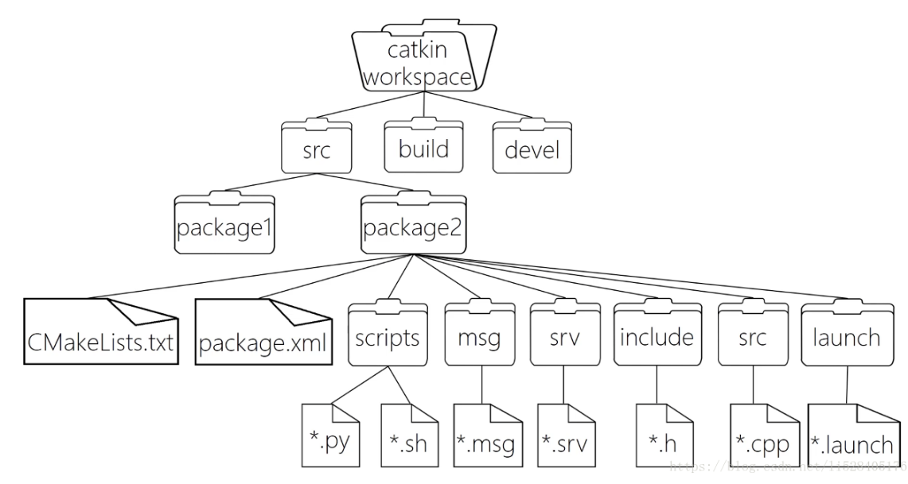
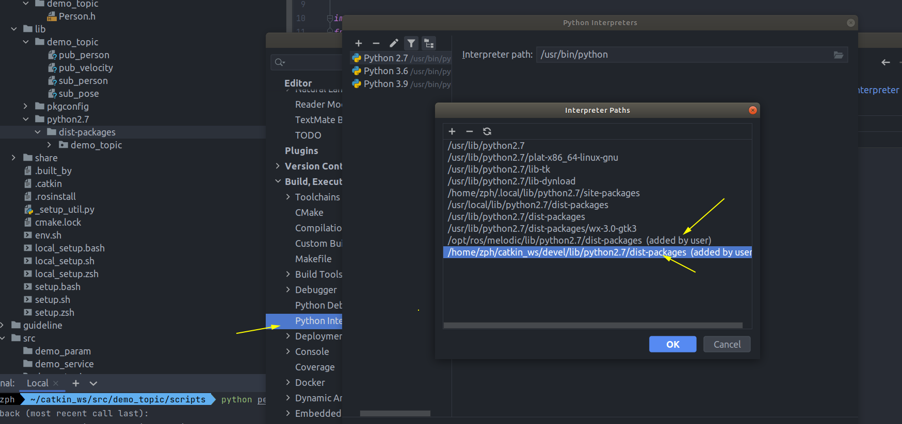

# 1.ROS介绍




## 1.3 架构介绍





## 1.4 文件系统：




ros官网：https://www.ros.org/

经典基础教程：https://github.com/ZhangPHEngr/ros_21_tutorials

ROS学习记录①：安装、起步和IDE工具 https://cloud.tencent.com/developer/article/1751210

上图参考来源：

​		https://robot.czxy.com/docs/ros/arch/file/ 

​		https://blog.csdn.net/FRIGIDWINTER/article/details/124024791

# 2.Ubuntu 18.04安装melodic

Ubuntu18.04 melodic 安装与下载ROS https://www.guyuehome.com/10082

问题记录：


# 3.Clion开发环境配置

Clion ROS插件：Hatchery

# 3.1 C++ 开发


官方配置说明：https://www.jetbrains.com/help/clion/ros-setup-tutorial.html#open-ros-prj


## 3.2 Python开发

melodic只支持python2.7！！！

- 需要先确认第三方库路径是否都已经添加否则显示缺失模块




- 使用python开发时需要进行log配置：

sudo vim python_logging.conf# 在文件中写入以下内容

```shell
# 如果需要写入文件需要在这里加入fileLogger
[loggers]
keys=root

[handlers]
keys=consoleHandler,fileHandler

[formatters]
keys=simpleFormatter

[logger_root]
level=DEBUG
handlers=consoleHandler # root默认使用命令行输出

[logger_fileLogger] # 不需要输入到文件中就不用写这个
level=DEBUG
handlers=fileHandler
qualname=fileLogger
propagate=0

[handler_consoleHandler]
class=StreamHandler
level=DEBUG
formatter=simpleFormatter
args=(sys.stdout,)

[handler_fileHandler]
class=FileHandler
level=DEBUG
formatter=simpleFormatter
args=('logs/logging.log', 'a')

[formatter_simpleFormatter]
#format=%(asctime)s - %(name)s - %(levelname)s - %(message)s
format=%(asctime)s - %(module)s - %(thread)d - %(levelname)s : %(message)s
datefmt=%Y-%m-%d %H:%M:%S
```
