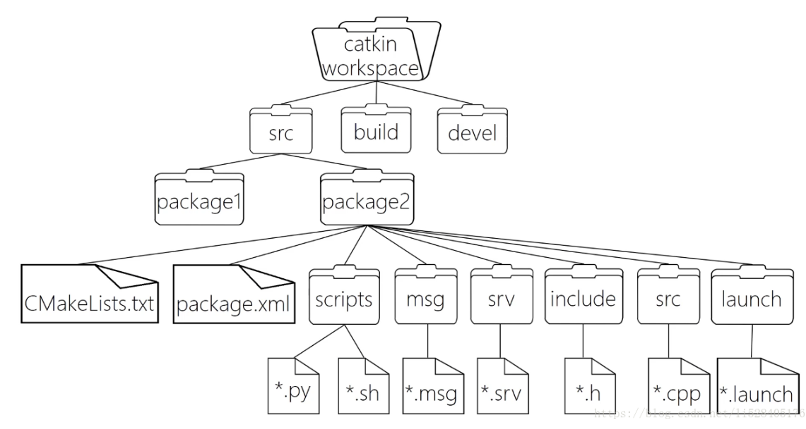

pkg CmakeLists.txt说明 https://blog.csdn.net/He3he3he/article/details/109715757


```shell
# 在手动创建catkin_ws/src catkin_ws/build catkin_ws/devel之后 初始化工程
cd catkin_ws/src
catkin_init_workspace
# 创建自己的pkg 可是使用以下指令创建（会生成cmakelist.txt） 也可以手动创建目录
catkin_create_pkg [pkg_name] roscpp rospy std_msgs
```


