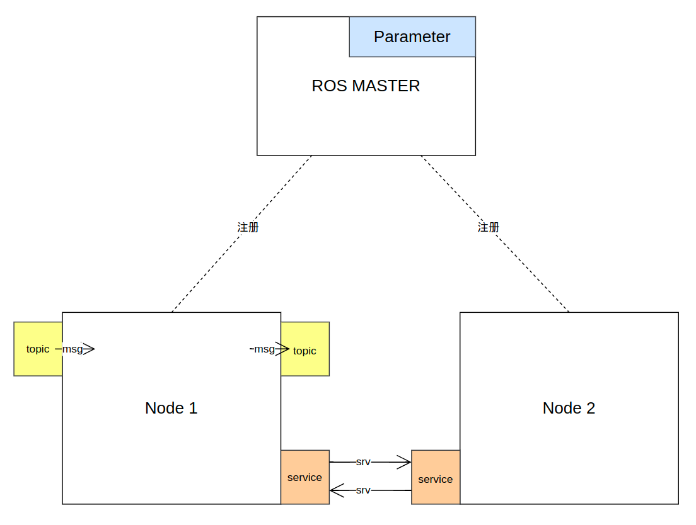

# 1.软件概念



| 概念                 | 描述                                                         | 备注 |
| -------------------- | ------------------------------------------------------------ | ---- |
| pkg_name             | 文件实体， 是一类功能Node集合和配套配置的存储目录，其编译后会生成至少一个Node |      |
| exe_name             | 文件实体，  是pkg_name目录下编译出的可执行文件， 该文件运行就会启动其定义的Node |      |
| ROS Master           | 软件实体， 一个特殊的node用于接收注册Node  Topic 和 Service，并建立他们之间的通信关系 |      |
|                      |                                                              |      |
| Node                 | 软件实体，是某个pkg_name中的exe_name被执行后， 在系统中运行的一个进程<br />每个Node中可以同时存在P/S和C/S两种通信方式 | 有名 |
| Parameter            | 存储实体，存储在rosmaster中的全局变量                        | 有名 |
|                      |                                                              |      |
| Publisher/Subscriber | P/S通信模式<br />Node启动时：<br />        会在输入口定义一个topic接收器并向master节点获取其想要topic的节点信息并连接<br />        会在Node输出口创建一个topic发送器并向master注册该topic |      |
| Topic                | 消息名， 用于承载msg， 在P/S中都会用到    msg是存储实体， 一段内存存放这按msg文件格式定义的消息 | 有名 |
| Client/Service       | C/S通信模式<br />Node启动时：<br />        会在输入口建立一个client请求器并向master注册服务请求获取服务节点信息<br />        会在输出口建立一个service发送器并向master注册服务任务 |      |
| Service              | 消息名， 用于承载srv， 在C/S中都会用到  srv是存储实体， 一段内存存放这按srv文件格式定义的消息 | 有名 |
|                      |                                                              |      |


# 2. P/S  和 C/S 开发方法

| 类型       | C++                                                          | Python                                                       |
| ---------- | ------------------------------------------------------------ | ------------------------------------------------------------ |
| Publisher  | p=handle.**advertise**\<T>("topic_name", queue_size);<br />p.publish(msg) | p=rospy.**Publisher**('topic_name', T, queue_size)<br />p.publish(msg) |
| Subscriber | s=handle.**subscribe**("topic_name", queue_size, callback);<br />void callback(const T::ConstPtr &msg); | rospy.**Subscriber**("topic_name", T, callback)<br />def callback(msg) |
| Service    | s=handle.**advertiseService**("service_name",callback);<br />bool personCallback(T::Request  &req,  T::Response &res); | rospy.**Service**('service_name', T, callback)<br />def personCallback(req) <br />        return PersonResponse("OK") |
| Client     | ros::service::waitForService("service_name");<br />client = handle.**serviceClient**\<T>("service_name");<br />client.call(srv); | rospy.wait_for_service('service_name')<br />client = rospy.**ServiceProxy**('service_name', T)<br />response = client(data) |


# 3. Parameter开发方法

| 类型      | C++                                                          | Python                                                       |
| --------- | ------------------------------------------------------------ | ------------------------------------------------------------ |
| Parameter | ros::param::get("para_name", data);<br />ros::param::set("para_name", data);<br />ros::param::del("para_name") | rospy.get_param("para_name")<br /> rospy.set_param("para_name", data)<br />rospy.delete_param("para_name") |


# 4.TF Tree

| 类型   |                                                              |      |
| ------ | ------------------------------------------------------------ | ---- |
| tf广播 | tf::StampedTransform transform;<br />tf::TransformBroadcaster broadcaster<br />broadcaster.sendTransform(tf::StampedTransform(transform, ros::Time::now(), “coord”, “coord_child”)); |      |
| tf监听 | tf::StampedTransform transform;<br />tf::TransformListener listener;<br />listener.waitForTransform("coord_child", "coord", ros::Time(0), ros::Duration(3));<br /> listener.lookupTransform("coord_child", "coord", ros::Time(0), transform); |      |


# 4.命名空间和名称

所有的Node, Topic, Service和Param都有名称，方便通信， 但是名称不能重复！！

命名空间类似于c++的namespace，规定了名称的前缀部分， 所有的名称到最后都是/A/B/C/D这样形式的！！！！

| 命名空间        | 含义   |      |
| --------------- | ------ | ---- |
| 全局命名空间(/) | 根节点 |      |
| 相对命名空间()  | 相对   |      |
| 私有命名空间(~) |        |      |

```shell
#-------------------------Node名称解析--------------
#node在建立时 只有这两种指定方法  一个是全局指定 一个是相对指定（默认值也是/）
ros::init(argc, argv, "/pose_subscriber")#初始命名空间为 / ， node名为/pose_subscriber
ros::init(argc, argv, "pose_subscriber")#初始命名空间为 /，node名为/pose_subscriber
#在启动node时可以切换初始命名空间为 /A/B/C  则node名就是/A/B/C/pose_subscriber

#-------------------------Service Topic Param名称解析--------------
#建立这些名称时， node已经获得名称
"/A" #指定在默认命名空间下，名称是/A
"A"  #默认相对命名空间为 /， 名称是/A
"～" # ros::NodeHandle n(~);指定私有handle后， 默认相对命名空间为 node名称
```


名称， 命名空间的含义：https://www.cnblogs.com/zjiaxing/p/5541841.html

命名空间和重映射：https://blog.csdn.net/jrc_january/article/details/76587630

# 5.启动方式

```shell
# --------------------------------rosrun方式启动-----------------------------------#
# 手动启动roscore
roscore
# 每次启动一个node
rosrun pkg_name exe_name
# 以上命令可以再加后缀进行node重命名 和 node命名空间改变
__name:=A			# 重命名
__ns:=/aa/bb   		# 修改命名空间
```

```shell
# --------------------------------launch方式启动-----------------------------------#
# 这种启动方式可以： 1.可以自动检查并启动roscore 2.可以同时启动多个node 3.可以调用其他launch文件 
roslaunch pkg_name xxx.launch

# 语法定义
<launch> </launch>	# 定义该xml文件
	<node * />		# 启动节点指定
		pkg:	# 节点名
		type:	# 节点可执行文件
		name:	# 重命名node 同 ros::init(argc, argv, name)
		ns:		# 修改命名空间
		output:	# log输出位置 “screen”
		args:	# 执行参数
	<param * />		#参数服务器  可以在node外，也可以在node内
		name		# key
		value		# value
	<rosparam * />	#参数服务器  可以在node外，也可以在node内
		file		# yaml
		command		# load
	<arg * />		# launch内部局部变量
		name		# key
		value		# value
	<remap>			# 重命名计算图资源 包括 node topic service param
		from		# 原命名
		to			# 映射后的名
	<include>
		file		# 调用其他launch文件
```


# 6. 常用debug命令

```shell
# -----------------------------rosnode--node相关-----------------------------# 
rosnode info node_name 输出此节点信息
rosnode list 列出所有当前运行的节点
rosnode kill node_name 关闭此节点
rosnode machine hostname 列出此主机上运行的节点
rosnode cleanup 清除无法访问节点的注册信息
rosnode ping node_name 测试节点的连通性

# -----------------------------rosparam--para相关-----------------------------# 
rosparam list 列出所有参数
rosparam get param_name 获取参数值
rosparam set param_name value 设置参数值
rosparam delete param_name 删除参数
rosparam dump filename 将参数字典保存到文件中
rosparam load filename 从文件中加载参数字典

# -----------------------------rostopic--topic相关-----------------------------# 
rostopic list 列出当前存在的话题
rostopic info topic_name 输出话题的相关信息，包括发布者、订阅者、以及相关服务的信息
rostopic bw topic_name 显示话题所占带宽
rostopic echo topic_name 输出本话题的消息
rostopic find msg_type 按照消息类型查找话题
rostopic hz topic_name 显示话题发布的频率
rostopic pub topic_name msg_data 向话题发布消息
rostopic type topic_name 输出本话题的消息类型（即消息名称）

# -----------------------------rosmsg--msg相关-----------------------------# 
rosmsg list 列出所有消息名
rosmsg md5 msg_name 输出一条消息数据的MD5求和结果
rosmsg package package_name 列出功能包中所有的消息
rosmsg packages  列出所有具有消息文件的功能包
rosmsg show msg_name 显示一条该消息的数据
rosmsg users  msg_name 搜索使用该消息类型的代码文件
rosmsg info msg_name 输出消息数据格式

# -----------------------------rosservice--service相关-----------------------------# 
rosservice list 列出当前存在的服务
rosservice info service_name 输出服务信息，包括服务节点名称、服务的ROSRPC uri、服务类型（即服务格式的名称）、服务的参数
rosservice call service_name request_param 调用服务
rosservice find srv_type 根据服务类型查找服务
rosservice args service_name 打印服务的参数
rosservice type service_name 输出服务的类型
rosservice uri service_name 输出服务的ROSRPC uri

# -----------------------------rosmsg--srv相关-----------------------------# 
rossrv show	Show service description
rossrv info	Alias for rossrv show
rossrv list	List all services
rossrv md5	Display service md5sum
rossrv package	List services in a package
rossrv packages	List packages that contain services
```


